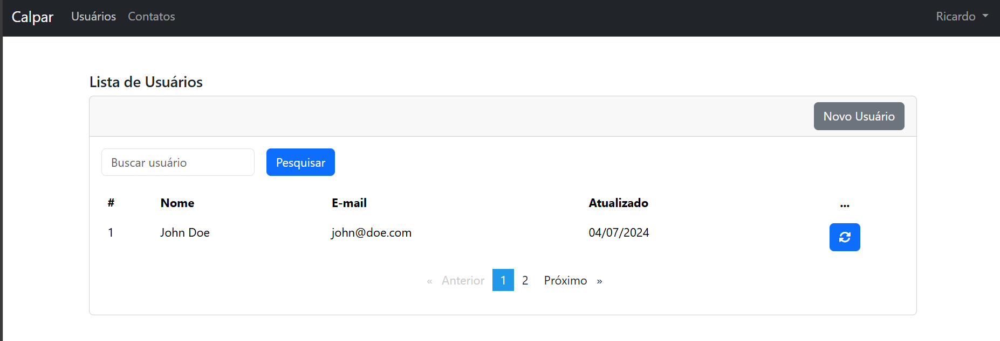
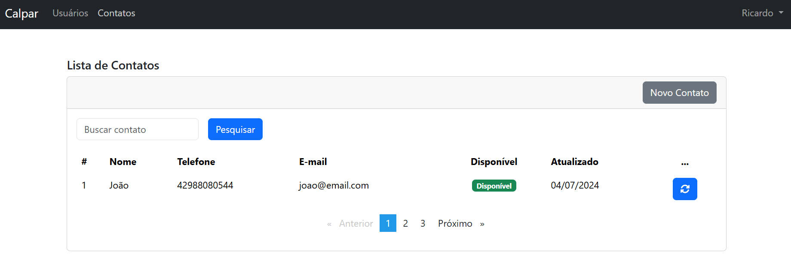
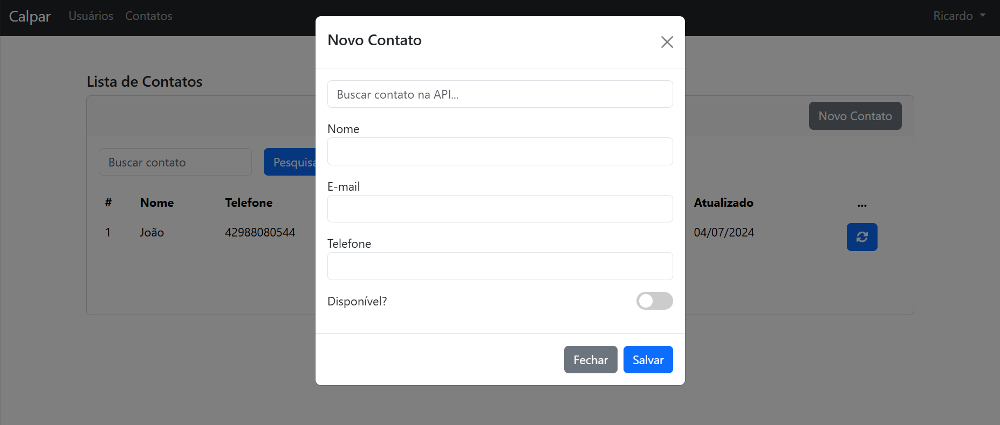

# Calpar Teste

Este é um projeto de teste desenvolvido para a Calpar. O objetivo deste projeto é demonstrar habilidades em desenvolvimento backend e frontend utilizando tecnologias como Laravel, Angular e Bootstrap.

## Tecnologias Utilizadas

- **Backend:** Laravel
- **Frontend:** Angular
- **Estilização:** Bootstrap
- **Banco de Dados:** MySQL
- **Outros:** TypeScript, PHP

## Estrutura do Projeto

- **app/**: Contém os arquivos do backend em Laravel.
- **bootstrap/**: Arquivos de configuração do Bootstrap.
- **config/**: Arquivos de configuração do Laravel.
- **database/**: Arquivos relacionados ao banco de dados, como migrações.
- **frontend/**: Contém os arquivos do frontend em Angular.
- **public/**: Arquivos públicos acessíveis diretamente.
- **resources/**: Arquivos de visualização do Laravel.
- **routes/**: Arquivos de rotas do Laravel.
- **storage/**: Arquivos de armazenamento do Laravel.
- **tests/**: Testes automatizados.

## Instalação

### Pré-requisitos

- PHP >= 7.4
- Composer
- Node.js
- NPM

### Passos

1. Clone o repositório:
    ```bash
    git clone https://github.com/ricardochomicz/calpar-teste.git
    cd calpar-teste
    ```

2. Instale as dependências do backend:
    ```bash
    composer install
    ```

3. Instale as dependências do frontend:
    ```bash
    cd frontend
    npm install
    cd ..
    ```

4. Configure o arquivo `.env`:
    ```bash
    cp .env.example .env
    php artisan key:generate
    ```

5. Configure o banco de dados no arquivo `.env`.

6. Execute as migrações:
    ```bash
    php artisan migrate
    ```

7. Inicie o servidor de desenvolvimento:
    ```bash
    php artisan serve
    ```

8. Inicie o frontend:
    ```bash
    cd frontend
    ng serve
    ```

## Uso

Após seguir os passos de instalação, o backend estará disponível em `http://localhost:8000` e o frontend em `http://localhost:4200`.

## Register


## Login


## Usuários


## Contatos


## Cadastrar Novo Contato



